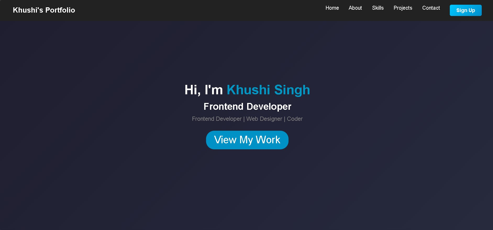

# 🌐 Personal Portfolio Website

A modern, responsive, and visually appealing Personal Portfolio Website built using HTML, CSS, and JavaScript to showcase my skills, projects, and journey as a Computer Science student and aspiring Java Full Stack Developer.

---

# 🚀 Live Demo

🌐 **Portfolio Website:**  
https://khushi-singh-dev.github.io/My_Portfolio/

---

# 📸 Preview



```md

```

---

# 👩‍💻 About Me

Hi, I'm **Khushi Singh**, a B.Sc. Computer Science student passionate about:

- 💻 Web Development
- ☕ Java Full Stack Development
- 🎨 UI/UX Design
- 🚀 Building Real-World Projects

This portfolio represents my learning journey, frontend skills, and passion for creating responsive and user-friendly web experiences.

---

# ✨ Features

✅ Clean and modern UI  
✅ Fully responsive design  
✅ Smooth scrolling effects  
✅ About Me section  
✅ Skills & Technologies section  
✅ Projects showcase section  
✅ Contact section  
✅ Interactive navigation bar  
✅ Mobile-friendly layout  
✅ Beginner-friendly clean code structure  

---

# 🛠️ Technologies Used

| Technology | Purpose |
|------------|----------|
| HTML5 | Website structure |
| CSS3 | Styling & responsiveness |
| JavaScript | Interactivity |
| Git & GitHub | Version control & deployment |

---

# 📂 Project Structure

```txt
Portfolio-Website/
│
├── index.html
├── style.css
├── script.js
├── images/
│   └── All images & assets
└── README.md
```

---

# 📱 Responsive Design

The portfolio is optimized for:

- 💻 Desktop
- 📱 Mobile
- 📲 Tablet

---

# 🎯 Purpose of This Portfolio

This portfolio was created to:

- Showcase my frontend development skills
- Display my projects and achievements
- Build a professional online presence
- Practice responsive web design
- Prepare for internships and placements

---

# 🧠 Learning Outcomes

This project helped me improve:

- Responsive Web Design
- Flexbox & CSS Layouts
- UI/UX Design Fundamentals
- JavaScript Interactivity
- Website Structuring
- GitHub Deployment
- Clean Code Practices

---

# 🚀 Featured Projects

Some projects showcased in this portfolio include:

- 🌟 Random Quote Generator
- ✅ To-Do List App
- 🍔 Food Delivery Website
- 🌄 MahaTour Website
- 🧮 Calculator Website
- 🌤️ Weather App (Upcoming)
- 📝 Notes App (Upcoming)

---

# 🔥 Challenges Faced

- Making layouts responsive on all devices
- Managing spacing and alignment
- Improving UI consistency
- Creating reusable sections
- Optimizing mobile responsiveness

---

# 🔮 Future Enhancements

🔹 Dark mode toggle  
🔹 Backend integration  
🔹 Blog section  
🔹 Contact form with backend  
🔹 Project filtering system  
🔹 Animations using JavaScript  
🔹 Performance optimization  
🔹 Download resume feature  

---

# 🌐 GitHub Repository

🔗 GitHub Repo:  
https://github.com/khushi-singh-dev/My_Portfolio

---

# 📬 Connect With Me

### 👩‍💻 Khushi Singh

- 📧 Email: khushisatishsingh211@gmail.com
- 💼 LinkedIn: https://www.linkedin.com/in/khushi-singh-68294028b
- 💻 GitHub: https://github.com/khushi-singh-dev
- ▶️ YouTube: https://www.youtube.com/@KHUSHISATISHSINGH211

---

# ⭐ Support

If you like this project:

⭐ Star the repository  
🍴 Fork the project  
📢 Share your feedback

---

# 📌 Project Status

✅ Completed  
🚀 Continuously improving and adding new features

