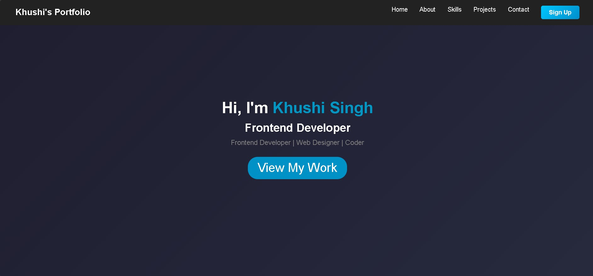

# 🌐 Personal Portfolio Website

A modern, responsive, and visually appealing Personal Portfolio Website built using HTML, CSS, and JavaScript to showcase my skills, projects, and journey as a Computer Science student and aspiring Java Full Stack Developer.

---

## 🚀 Live Demo

🌐 **Portfolio Website:**  
https://khushi-singh-dev.github.io/My_Portfolio/

---

## 📸 Preview



---

## 👩‍💻 About Me

Hi, I'm **Khushi Singh**, a B.Sc. Computer Science student passionate about:

- 💻 Web Development
- ☕ Java Full Stack Development
- 🎨 UI/UX Design
- 🚀 Building Real-World Projects

This portfolio represents my learning journey, frontend skills, and passion for creating responsive and user-friendly web experiences.

---

## ✨ Features

✅ Clean and modern UI  
✅ Fully responsive design  
✅ Smooth scrolling effects  
✅ About Me section  
✅ Skills & Technologies section with dynamic animations  
✅ Projects showcase section  
✅ Achievements section  
✅ Contact section  
✅ Interactive navigation bar  
✅ Mobile-friendly hamburger menu  
✅ Sign-up modal  
✅ Beginner-friendly clean code structure  
✅ Accessible design with ARIA labels  

---

## 🛠️ Technologies Used

| Technology | Purpose |
|------------|----------|
| HTML5 | Website structure |
| CSS3 | Styling, animations & responsiveness |
| JavaScript | Interactivity & dynamic effects |
| Git & GitHub | Version control & deployment |

---

## 📂 Project Structure

```
Portfolio-Website/
│
├── index.html        # Main HTML file
├── style.css         # Styling & responsive design
├── script.js         # JavaScript interactivity
├── images/           # All images & assets
│   ├── Profile_Picture.jpg
│   ├── myportfolioimg.jpg
│   ├── yumlicious.jpg
│   ├── 1st_rank_website.jpg
│   ├── random-quote-gen.jpg
│   ├── TodoList.jpg
│   └── bg.png
└── README.md         # Project documentation
```

---

## 📱 Responsive Design

The portfolio is optimized for all screen sizes:

- 💻 Desktop (1024px and above)
- 📲 Tablet (768px to 1023px)
- 📱 Mobile (Below 768px)

---

## 🎯 Purpose of This Portfolio

This portfolio was created to:

- Showcase my frontend development skills
- Display my projects and achievements
- Build a professional online presence
- Practice responsive web design
- Demonstrate JavaScript interactivity
- Prepare for internships and placements

---

## 🧠 Learning Outcomes

This project helped me improve:

- **Responsive Web Design** - Mobile-first approach with media queries
- **Flexbox & CSS Layouts** - Modern layout techniques
- **UI/UX Design Fundamentals** - Clean, intuitive interfaces
- **JavaScript Interactivity** - DOM manipulation and event handling
- **Web Accessibility** - ARIA labels and semantic HTML
- **GitHub Deployment** - GitHub Pages publishing
- **Clean Code Practices** - Organized, readable code

---

## 🚀 Featured Projects

Some projects showcased in this portfolio include:

- 🌟 **Random Quote Generator** - API integration with dynamic quotes
- ✅ **Todo List App** - Task management with local storage
- 🍔 **Food Delivery Website** - Responsive restaurant UI
- 🌄 **MahaTour Website** - Tourism and travel showcase
- 🧮 **Calculator Website** - Interactive calculations
- 🌤️ **Weather App** - Real-time weather data
- 📝 **Notes App** - Digital note-taking

---

## 🔥 Challenges Faced & Solutions

| Challenge | Solution |
|-----------|----------|
| Responsive layouts on all devices | Used Flexbox and media queries |
| Hamburger menu overlap with buttons | Adjusted positioning with z-index |
| Section heading consistency | Removed text shadows for clean look |
| Skills section interactivity | Added dynamic progress animations |

---

## 🔮 Future Enhancements

🔹 Dark mode toggle  
🔹 Backend integration with Node.js/Express  
🔹 Blog section for tech articles  
🔹 Contact form with email backend  
🔹 Project filtering and search system  
🔹 Advanced animations using GSAP  
🔹 Performance optimization (lazy loading, minification)  
🔹 SEO improvements  
🔹 Social media integration  
🔹 3D animations and effects  

---

## 📊 Skills Breakdown

| Skill | Level |
|-------|-------|
| HTML5 | 90% |
| CSS3 | 89% |
| JavaScript | 80% |
| React | 80% |
| Java | 70% |
| Spring Boot | 65% |
| Django | 60% |
| Git & GitHub | 60% |
| MySQL | 85% |
| Bootstrap | 75% |
| Python | 70% |

---

## 🌐 GitHub Repository

🔗 **GitHub Repo:**  
https://github.com/khushi-singh-dev/My_Portfolio

---

## 📬 Connect With Me

### 👩‍💻 Khushi Singh

- 📧 **Email:** khushisatishsingh211@gmail.com
- 💼 **LinkedIn:** https://www.linkedin.com/in/khushi-singh-68294028b
- 💻 **GitHub:** https://github.com/khushi-singh-dev
- ▶️ **YouTube:** https://www.youtube.com/@KHUSHISATISHSINGH211

---

## ⭐ Support

If you like this project, please consider:

⭐ Starring the repository  
🍴 Forking the project  
📢 Sharing your feedback  
🐛 Reporting issues  

---

## 📄 License

This project is open source and available under the MIT License.

---

## 📌 Project Status

✅ Completed - Version 1.0  
🚀 Continuously improving and adding new features  
📅 Last Updated: August 2026

---

**Happy Coding! 💻✨**
